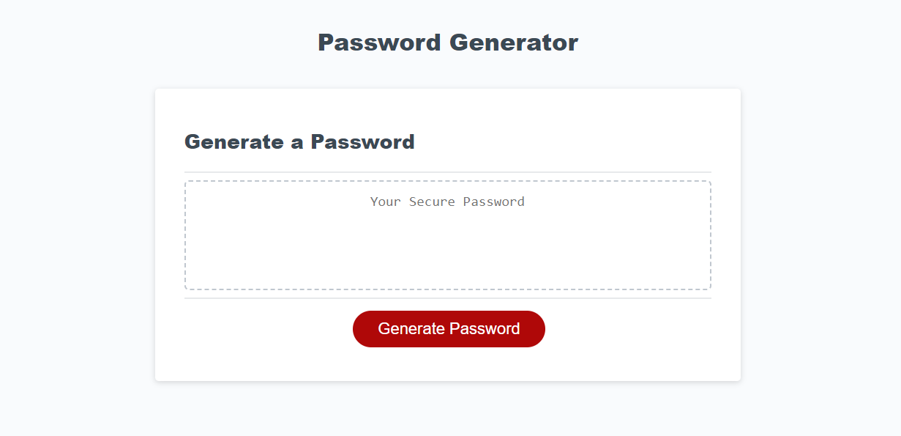

Overview

This JavaScript application empowers users, especially employees handling sensitive data, to generate secure and random passwords based on their selected criteria. It offers a dynamic, responsive user interface that functions seamlessly across various screen sizes.

Features

Criteria-Based Generation: Users can generate passwords based on specific criteria, including length and character types (lowercase, uppercase, numeric, and special characters).
Responsive UI: The application adapts to different screen sizes, ensuring a consistent user experience.
Customizable Length: Password length can be set between 8 and 128 characters.
Character Type Selection: Users have the option to include or exclude specific character types in their password.
Validation: The application validates user inputs to ensure at least one character type is selected.